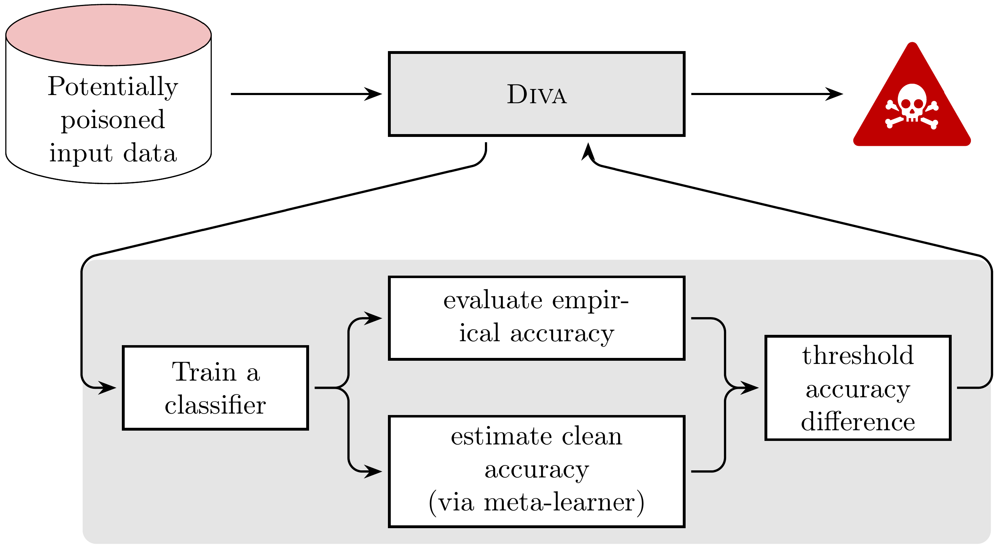
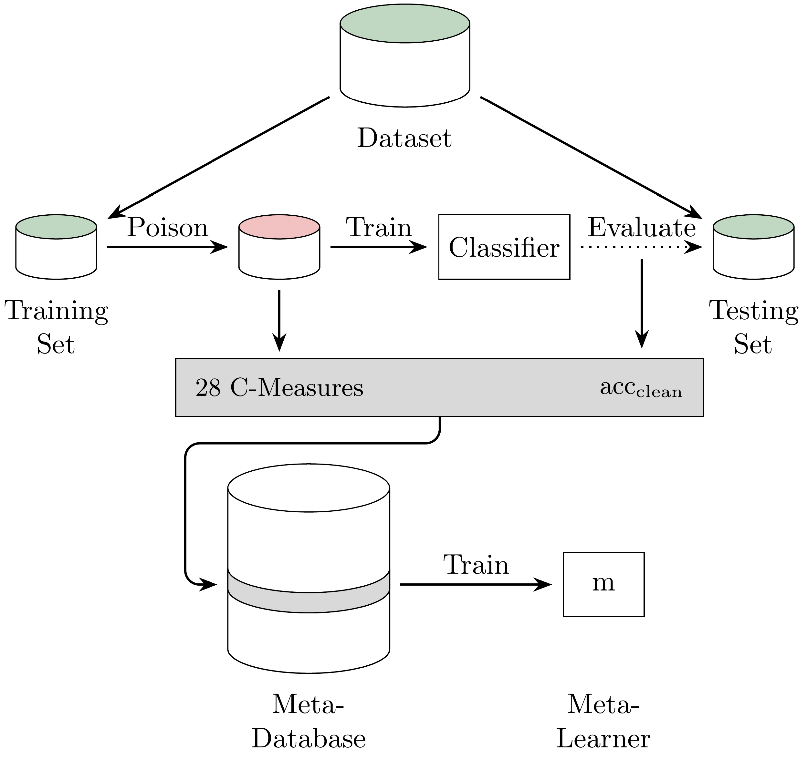

# Poison is Not Traceless: Fully-Agnostic Detection of Poisoning Attacks

## Abstract

The performance of machine learning models depends on the quality of the underlying data. Malicious actors can attack the model by poisoning the training data. Current detectors are tied to either specific data types, models, or attacks, and therefore have limited applicability in real-world scenarios. This paper presents a novel fully-agnostic framework, DIVA (Detecting InVisible Attacks), that detects attacks solely relying on analyzing the potentially poisoned data set. DIVA is based on the idea that poisoning attacks can be detected by comparing the classifier's accuracy on poisoned and clean data and pre-trains a meta-learner using Complexity Measures to estimate the otherwise unknown accuracy on a hypothetical clean dataset. The framework applies to generic poisoning attacks. For evaluation purposes, in this paper, we test DIVA on label-flipping attacks.

## Supplementary material

The supplementary material is available [here](./SupplementaryMaterial.pdf).

## DIVA (Detecting InVisible Attacks)

We propose DIVA (Detecting InVisible Attacks), a novel framework that detects poisoning attacks by comparing the discrepancy between the classifier's theoretical accuracy and the empirical accuracy on the given training data.



At prediction time, DIVA extracts C-Measures from potentially poisoned data, and uses it to estimate the clean accuracy.
A dataset is flagged as poisoned if the discrepancy exceeds a certain threshold.



DIVA pre-trains a meta-learner as follows:

1. Collect multiple datasets; One of them is the input dataset here.
2. Split each dataset into training and testing sets and generate multiple poisoned datasets from the training set.
3. Create a meta-database by extracting C-Measures from the clean and poisoned datasets as features and using the classifiers' accuracies as targets.
4. Train the meta-learner.

## Install dependencies

### Install R

`R` is required for computing C-Measures. Two additional libraries are required:

- `tidyverse`
- `ECoL`

To check the R requirements, run:

```bash
Rscript ./demo/check_packages.R
```

### Install Python Virtual environment

Virtual environment is created using `Python 3.8.10` with `PyTorch 1.10.1 (CUDA=11.3)`.

Code was tested on Ubuntu 20.04.3 LTS.

The script for creating virtual environment with Python 3.8 on Linux is:

```bash
bash ./install.sh
```

The script for manually install all packages is the following:

```bash
# Create virtual environment
python3.8 -m venv venv
source ./venv/bin/activate

# Upgrade pip
pip install --upgrade pip

# Install PyTorch
pip install torch==1.10.1+cu113 torchvision==0.11.2+cu113 torchaudio==0.10.1+cu113 -f https://download.pytorch.org/whl/cu113/torch_stable.html

# Install from requirements.txt
pip install -r requirements.txt

# Install local package in editable mode
pip install -e .
```

## Run experiments

The experiment contains 3 parts:

1. On real datasets
2. On synthetic datasets
3. Test baseline model

The following scripts are prepared to run the full experiments:

```bash
# Run experiments on real datasets
bash ./bash/run_full_exp_real.sh

# Run experiments on synthetic datasets
bash ./bash/run_full_exp_synth.sh
```

The experiments also can be run step by step by following the step number from `./experiments/` directory.

## Code demo

There are multiple demo scripts available under `./demo/` directory.
The plots can only be created after the experiments have been completed.

## Figures

All plots and corresponding values which are used in the paper can be found under `./results_plot` directory.
