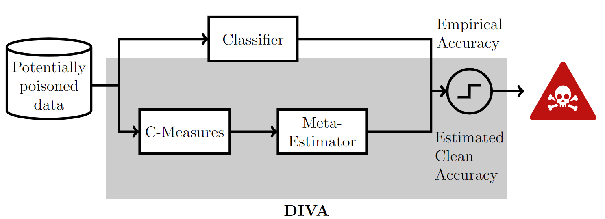
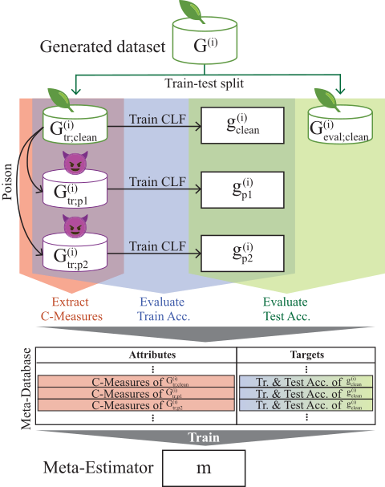

# Poison is not Traceless: Black-Box Detection of Poisoning Attacks

## Abstract

Machine learning has proven to be a powerful tool, but its performance depends on the quality of the underlying data. Malicious actors can attack the model by poisoning the training data. One such attack, the label poisoning attack, aims to degrade prediction performance by injecting misleading labels. Previous defenses against such attacks assume that a clean validation set is available. However, clean data is often absent when the validation and training sets come from the same source. Without knowing the ground truth, current approaches cannot determine whether a dataset is poisoned or not. This paper presents a novel framework, \diva (Detecting InVisible Attacks), which determines if a data set has been poisoned, even when a clean validation set is not available. Based on the idea that label poisoning attacks can be detected by comparing the classifier's accuracy between poisoned and clean data, we extract Complexity Measures from the data and use them to train a meta-estimator to predict the classifier's theoretical accuracy on untampered data.
To efficiently generate metadata, we introduce a novel fast poisoning attack, FALFA (Fast Adversarial Label Flipping Attack). Our experiments confirm that \diva can detect unknown attacks when presented with only poisoned data, even against strong adversaries where as much as 40\% of the training data is corrupted.

## DIVA (Detecting InVisible Attacks)

We propose DIVA (Detecting InVisible Attacks), a novel framework that detects poisoning attacks by comparing the discrepancy between the classifier's theoretical accuracy and the empirical accuracy on the given training data.



At prediction time, DIVA extracts C-Measures from potentially poisoned data, and uses it to estimate the clean accuracy.
A dataset is flagged as poisoned if the discrepancy exceeds a certain threshold.



DIVA constructs a meta-database by extracting C-Measures from generated datasets $G^{(i)}$. By generating multiple poisoned datasets $G^{(i)}_{\text{tr;}p_j}$ with poisoned classifiers $g^{(i)}_{p_j}$ from the training split $G^{(i)}_{\text{tr;clean}}$, the meta-dataset collects multiple C-Measures and accuracy pairs for each $G^{(i)}$.

## Supplementary material

The supplementary material is available [here](./SupplementaryMaterial.pdf).

## Install dependencies

### Install R

`R` is required for computing C-Measures. Two additional libraries are required:

- `tidyverse`
- `ECoL`

To check the R requirements, run:

```bash
Rscript ./demo/check_packages.R
```

### Install Python Virtual environment

Virtual environment is created using `Python 3.8.10` with `PyTorch 1.10.1 (CUDA=11.3)`.

Code was tested on Ubuntu 20.04.3 LTS.

The script for creating virtual environment with Python 3.8 on Linux is:

```bash
bash ./install.sh
```

The script for manually install all packages is the following:

```bash
# Create virtual environment
python3.8 -m venv venv
source ./venv/bin/activate

# Upgrade pip
pip install --upgrade pip

# Install PyTorch
pip install torch==1.10.1+cu113 torchvision==0.11.2+cu113 torchaudio==0.10.1+cu113 -f https://download.pytorch.org/whl/cu113/torch_stable.html

# Install from requirements.txt
pip install -r requirements.txt

# Install local package in editable mode
pip install -e .
```

## Run experiments

The experiment contains 3 parts:

1. On real datasets
2. On synthetic datasets
3. Test baseline model

The following scripts are prepared to run the full experiments:

```bash
# Run experiments on real datasets
bash ./bash/run_full_exp_real.sh

# Run experiments on synthetic datasets
bash ./bash/run_full_exp_synth.sh
```

The experiments also can be run step by step by following the step number from `./experiments/` directory.

## Code demo

There are multiple demo scripts available under `./demo/` directory.
The plots can only be created after the experiments have been completed.

## Figures

All plots and corresponding values which are used in the paper can be found under `./results_plot` directory.
